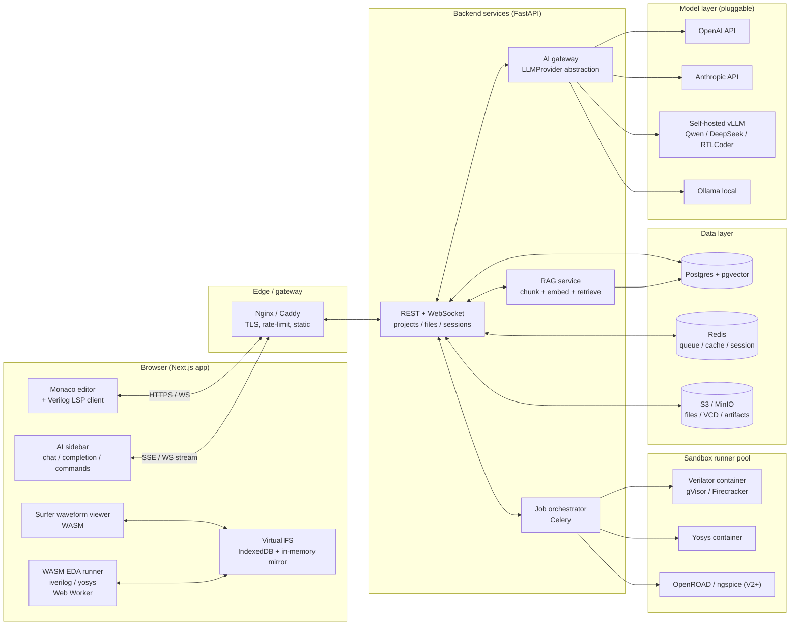
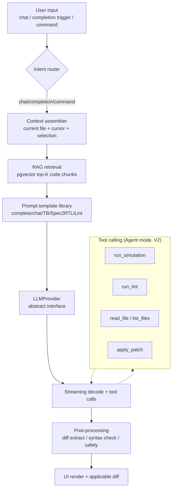
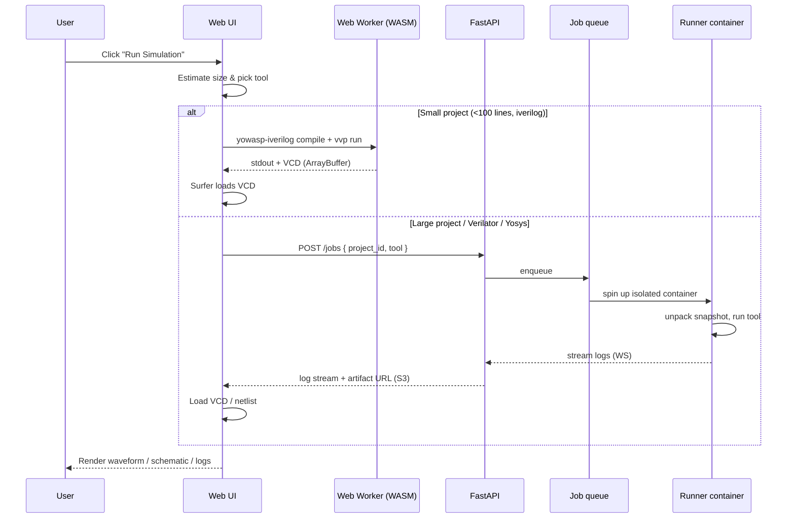
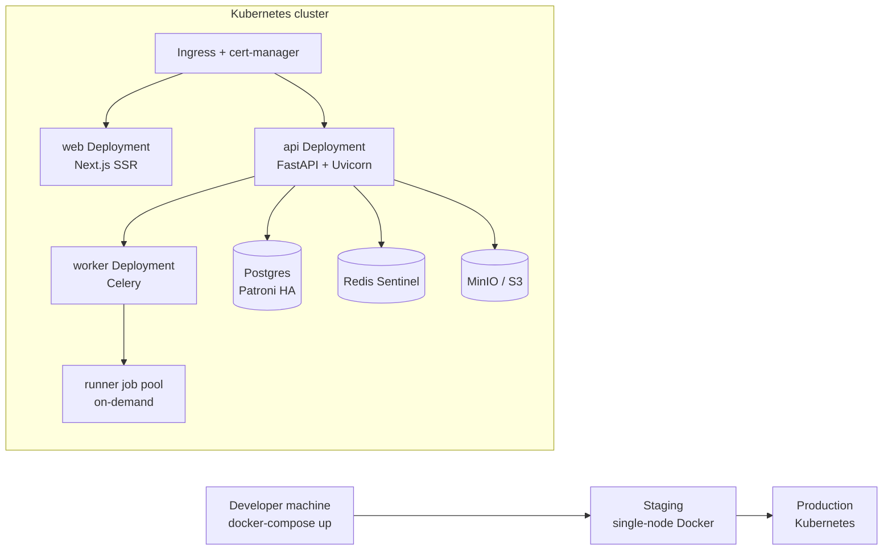

# ChipForge Architecture

> Authoritative technical proposal for ChipForge, a Web AI IDE for chip design engineers.
> Status: **v0.1 (bootstrap)**. This document accompanies PR #1 (monorepo skeleton) and is
> the canonical reference for subsequent PRs.

## 0. TL;DR

ChipForge is a browser-native IDE that puts AI at the center of the digital-design
workflow (with later extensions to verification, synthesis, and analog). The MVP focuses on
Verilog / SystemVerilog:

1. **AI-native**: inline completion, Chat, Spec→RTL, testbench generation, lint explanation,
   waveform Q&A, cross-file RAG — all behind an `LLMProvider` abstraction so any backend
   (OpenAI / Anthropic / vLLM / Ollama) can be plugged in.
2. **Zero-install simulation**: Icarus Verilog and Yosys run in the browser via
   [YoWASP](https://yowasp.org/); heavier jobs (Verilator, large synthesis) run in
   sandboxed server-side Docker containers.
3. **Visualization**: [Surfer](https://surfer-project.org/) (Rust/WASM) for waveforms,
   netlistsvg for schematics, FSM extraction in V1.
4. **Engineering**: pnpm + Turborepo monorepo for JS, uv for Python, FastAPI +
   Postgres + pgvector + Redis + Celery backend, `docker-compose up` to run locally,
   Vercel (web) + Fly.io (api) for preview deploys.

## 1. Target users

| Persona                     | Pain today                                              | ChipForge value                                                               |
| --------------------------- | ------------------------------------------------------- | ----------------------------------------------------------------------------- |
| Digital RTL designer        | Repetitive module/interface boilerplate; cryptic lint   | AI completion, module generators, natural-language lint explanations, RAG Q&A |
| Verification engineer       | Slow to stand up testbenches; coverage gaps hard to see | Testbench / UVM generation, coverage-gap suggestions, constraint hints        |
| SoC architect               | Long path from spec doc to RTL prototype                | Spec (EN/中文) → top-level skeleton + interface contracts + initial RTL       |
| FPGA / educational user     | High barrier: toolchain install takes a day             | Open link → run simulation → see waveform                                     |
| Backend / PD (V2+)          | Synthesis & PnR are black boxes; tuning is folklore     | Yosys/nextpnr log parsing + AI tuning suggestions                             |
| Analog / mixed-signal (V2+) | Scopes, SPICE params, device selection are scattered    | ngspice integration + AI-assisted parameter sweeps                            |

## 2. Scope & roadmap

| Capability    | MVP (4 wk)                               | V1 (4–8 wk)                               | V2 (8–16 wk)                    |
| ------------- | ---------------------------------------- | ----------------------------------------- | ------------------------------- |
| Editor        | Monaco, Verilog/SV highlight, multi-file | VHDL/Chisel, symbol jump, format          | Realtime collab (Yjs)           |
| AI chat       | Sidebar streaming, current file context  | Cross-file RAG, @file/@symbol refs        | Agent mode (tool calling)       |
| AI completion | Ghost text single-file                   | FIM + project context                     | Custom fine-tuned model         |
| Spec → RTL    | Counter/FSM/mux templates                | NL spec → module skeleton + ports         | Arch doc → multi-module top     |
| Testbench     | Port-stimulus generator                  | UVM base + coverage hints                 | SVA / formal properties         |
| Lint          | Verible/iverilog warnings + AI explain   | Style-rule presets                        | Custom rule DSL                 |
| Simulation    | WASM iverilog single-file                | Server Verilator sandbox                  | Regression matrix, CI hooks     |
| Waveform      | Surfer embed, signal search              | AI waveform Q&A                           | Timing-violation visual overlay |
| Synthesis     | —                                        | Yosys WASM, gate count, netlist schematic | nextpnr + FPGA bitstream        |
| Backend / PD  | —                                        | —                                         | OpenROAD                        |
| Analog        | —                                        | —                                         | ngspice + AI analysis           |

## 3. System architecture

### 3.1 Overview



### 3.2 AI pipeline



**Key choices:**

- **`LLMProvider` interface**: `chat(messages, …) -> AsyncIterator[str]`, `complete(prompt) -> str`, `embed(texts) -> list[list[float]]`. The skeleton ships `MockProvider` (no network) so every other PR can land with green tests. Real backends arrive in PR #7.
- **Prompt library**: YAML files under `docs/prompts/`, loaded at startup, hot-reloadable. Verilog/SV system prompts enforce reset conventions, non-blocking assignments, and a synthesizable subset.
- **RAG chunking**: AST-aware — split on `module` / `always` block / `function` boundaries rather than line counts. Embedding model is configurable (`text-embedding-3-small` by default, swap for code-specific model in V2). Index lives in pgvector; saves trigger incremental re-embedding.
- **Safety**: strip untrusted system directives from file content, redact secrets from outputs, per-user token quota.

### 3.3 Simulation / synthesis execution flow



WASM toolchain status (verified):

- **iverilog**: custom WASM build; runs in a Web Worker via YoWASP-style glue.
- **Yosys**: [YoWASP/yosys](https://github.com/YoWASP/yosys) is mature and npm-installable.
- **Verilator**: WASM build is unstable and slow to compile → server-side only.
- **Waveform**: [Surfer](https://surfer-project.org/) Rust/WASM viewer, embeddable via iframe or direct bundle (proven by the surfer-vscode port).
- **Lint**: [Verible](https://github.com/chipsalliance/verible) has an experimental WASM build; fall back to a server run that returns JSON.

### 3.4 Frontend (`apps/web`)

- **Framework**: Next.js 14 (App Router) + TypeScript 5 + React 18.
- **Editor**: `monaco-editor` with a custom `@chipforge/verilog-lang` contribution (Monarch tokenizer + Tree-sitter WASM).
- **UI**: Tailwind + shadcn/ui + Radix, dark theme by default.
- **Layout**: `react-resizable-panels` three-column VS Code-style shell.
- **State**: Zustand (global) + TanStack Query (server state).
- **Terminal**: `xterm.js` for iverilog / yosys logs.
- **Web Worker**: EDA WASM runs off the main thread; `Comlink` simplifies messaging.
- **Virtual FS**: lightweight layer backed by IndexedDB + in-memory mirror; backend is the source of truth.

### 3.5 Backend (`apps/api`)

- **Framework**: FastAPI (Python 3.11+) + Pydantic v2 + SQLAlchemy 2.0 + Alembic.
- **Auth**: OAuth2 (GitHub, later Google) + JWT; API tokens for programmatic access.
- **WebSockets**: `/ws/projects/{id}` for edit events, AI streams, and job logs.
- **Job queue**: Celery + Redis. CPU-heavy work (Verilator, Yosys) is dispatched to a runner pool.
- **Runner sandboxing**: Docker-in-Docker or gVisor. Resource limits per job: 2 CPU / 4 GB / 60 s CPU time / no network.
- **Storage**:
  - Postgres: users, projects, file metadata, job records, chat history, pgvector embeddings.
  - S3 / MinIO: file snapshots, VCD, netlists, bitstreams.
  - Redis: sessions, queues, rate-limit counters.

### 3.6 Observability

- Structured JSON logs (`structlog`), unified `trace_id`.
- Prometheus + Grafana for RPS, AI token spend per user, queue wait time.
- OpenTelemetry traces from browser → API → LLM provider → runner.
- AI cost ledger per request: model, prompt_tokens, completion_tokens, latency, cost_usd, aggregated per user / project.

### 3.7 Deployment



For the MVP we use Vercel (frontend) + Fly.io (backend) for preview and managed Postgres from Fly or Neon.

## 4. Repository layout

```
chipforge/
├── apps/
│   ├── web/        # Next.js 14 frontend
│   └── api/        # FastAPI backend
├── packages/
│   ├── ai-core/
│   ├── eda-wasm/
│   ├── verilog-lang/
│   └── ui/
├── runners/
│   ├── verilator/
│   └── yosys/
├── infra/
│   └── docker-compose.yml
├── docs/
│   ├── architecture.md (this file)
│   ├── adr/
│   └── prompts/
└── .github/workflows/ci.yml
```

## 5. Milestones (MVP)

| PR  | Scope                                                                |
| --- | -------------------------------------------------------------------- |
| #1  | Monorepo skeleton, CI, Docker Compose, Vercel + Fly config (this PR) |
| #2  | Web shell (three-column layout + static placeholders)                |
| #3  | API shell (FastAPI + Postgres + Alembic + `/health`)                 |
| #4  | Auth (GitHub OAuth + JWT + users table)                              |
| #5  | Project / file CRUD + frontend file tree                             |
| #6  | Monaco integration + Verilog/SV highlighting + autosave              |
| #7  | `LLMProvider` abstraction + Mock + OpenAI + streaming API            |
| #8  | AI sidebar chat (streaming + current-file context)                   |
| #9  | Inline completion (ghost text)                                       |
| #10 | WASM iverilog runner (Web Worker) + "Run" button + log terminal      |
| #11 | Surfer embed + VCD loader                                            |
| #12 | Example projects (counter / FSM / UART) + README + demo recording    |

V1 (PRs #13–#20): RAG, testbench generation, Spec→RTL, lint, server Verilator, Yosys synthesis, netlistsvg.

V2 (PRs #21+): realtime collab, agent mode, UVM, OpenROAD, ngspice, self-hosted models.

## 6. Key risks

| Risk                                                           | Impact            | Mitigation                                                                       |
| -------------------------------------------------------------- | ----------------- | -------------------------------------------------------------------------------- |
| WASM iverilog doesn't support all SV constructs                | High (MVP)        | Limit MVP examples to synthesizable Verilog-2005; SV goes server-side            |
| LLM hallucinations on Verilog (port widths, clock domains)     | High              | Auto-lint generated RTL; retry on failure; V1 brings in domain-specific RTLCoder |
| AI cost runaway                                                | Medium            | Per-user daily token quota; prompt cache; batch embeddings                       |
| IP / confidentiality (enterprise won't send RTL to public LLM) | High (commercial) | `LLMProvider` is pluggable from day one; ship self-hosted deploy guide           |
| Large VCD blows browser memory                                 | Medium            | Server-side streaming slices (Surfer supports)                                   |
| Malicious Verilog causes runner to hang / OOM                  | Medium            | CPU time limits, cgroup memory, gVisor, network off                              |
| HDL language sprawl (VHDL, Chisel, Amaranth)                   | Low (V1+)         | Verilog/SV first; GHDL WASM for VHDL in V1; Chisel server-side in V2             |
